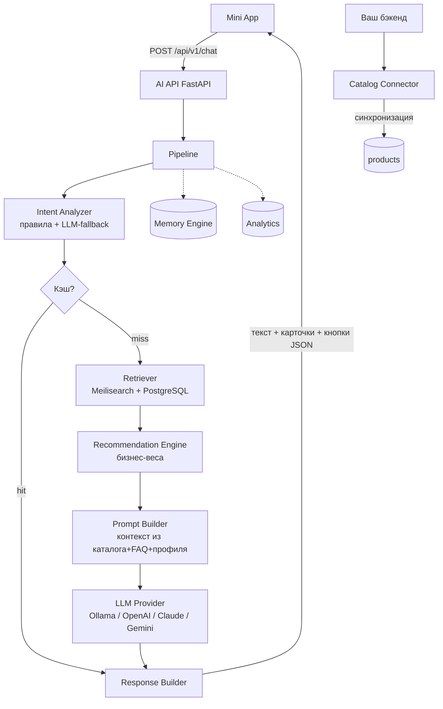
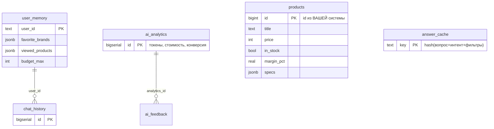

# AI Engine — автономный AI-модуль для Telegram Mini App магазина техники

Независимый сервис. Подключается к основному проекту через REST API как Lego-блок:
основной проект **не меняется**, он лишь дергает несколько эндпоинтов и отдаёт каталог.

## Ключевые свойства
- **Ноль галлюцинаций**: карточки (цена, наличие, характеристики) собираются из БД,
  а не из вывода модели. LLM пишет только текст и видит только найденные товары.
- **Минимум расходов**: правила → кэш → поиск → и только потом LLM.
  FAQ-интенты (гарантия/оплата/доставка/trade-in) отвечают вообще без модели.
  Полный каталог в модель не отправляется никогда (максимум `MAX_PRODUCTS_TO_LLM`, по умолчанию 12).
- **Смена LLM через ENV**: `LLM_PROVIDER=ollama|openai|anthropic|gemini|deepseek` — без правок кода.
- **Recommendation Engine**: коммерческие решения (наличие, маржа, акции, персонализация)
  принимает бизнес-логика с настраиваемыми весами (`config/settings.yaml`), а не модель.
- **Воспроизводимость**: temperature 0.2, детерминированное ранжирование, кэш ответов,
  полный лог (вопрос/ответ/модель/токены/стоимость) в `ai_analytics`.

## Архитектура


## Структура папок
```
ai-engine/
├── app/
│   ├── main.py               # точка входа, DI, lifespan
│   ├── config.py             # ENV + YAML конфиги
│   ├── api/                  # REST-слой (routes, schemas)
│   ├── core/                 # pipeline, intent, retriever, recommender,
│   │                         # prompt_builder, response_builder, memory, cache
│   ├── llm/                  # base (интерфейс), providers, factory
│   ├── connectors/           # адаптеры: каталог, CRM, синхронизация
│   └── analytics/            # логирование + дашборд для админки
├── config/
│   ├── prompts/system.yaml   # промпты ОТДЕЛЬНО от кода
│   └── settings.yaml         # веса ранжирования, FAQ
├── migrations/001_init.sql   # схема БД (авто-применяется при первом старте)
├── tests/
├── docker-compose.yml        # ai-engine + postgres + redis + meilisearch + ollama
└── docs/INTEGRATION.md       # как подключить к вашему проекту
```

## ER-диаграмма


## Быстрый старт
```bash
cp .env.example .env          # заполните ключи и CATALOG_API_URL
docker compose up -d --build
docker compose exec ollama ollama pull qwen2.5:7b-instruct   # локальная модель
curl -X POST http://localhost:8080/api/v1/admin/sync-catalog -H "X-API-Key: change-me"
curl -X POST http://localhost:8080/api/v1/chat -H "X-API-Key: change-me" \
  -H "Content-Type: application/json" \
  -d '{"user_id":"42","message":"Подберите ноутбук до 150 тысяч для монтажа"}'
```
OpenAPI-спецификация генерируется автоматически: `http://localhost:8080/docs`
(интерактивная) и `http://localhost:8080/openapi.json` (для кодогенерации клиента).

## Формат ответа /chat
```json
{
  "text": "Для монтажа подойдут эти модели — у всех мощный процессор и хороший экран.",
  "cards": [{
    "id": 1, "title": "MacBook Pro 14", "price": 149000, "old_price": null,
    "in_stock": true, "rating": 4.9, "image": "https://...", "url": "https://...",
    "why": ["в наличии", "рейтинг 4.9"],
    "buttons": [
      {"type": "open_product", "label": "Подробнее", "product_id": 1},
      {"type": "add_to_cart", "label": "В корзину", "product_id": 1}
    ]
  }],
  "actions": [{"type": "compare", "label": "Сравнить", "product_ids": [1,2,3]}],
  "meta": {"intent": "recommend", "latency_ms": 850, "cache_hit": false,
           "analytics_id": 17, "model": "qwen2.5:7b-instruct"}
}
```

## Производительность (< 2 сек в типовых сценариях)
- FAQ-интенты: ~50 мс (без LLM)
- Повторные вопросы: ~30 мс (кэш Redis)
- Поиск без LLM (`/search`): ~100 мс
- Полный пайплайн с локальной Ollama 7B: 1–2 с; дорогие облачные вызовы — исключение.

## Тесты
```bash
docker compose exec ai-engine pytest -q
```

## Безопасность
- Все эндпоинты (кроме /health) — под `X-API-Key`.
- SQL — только параметризованные запросы.
- Валидация входа Pydantic (лимиты длины, диапазоны).
- LLM никогда не получает сырые данные CRM целиком — только агрегированный профиль.
- Промпт-инъекция ограничена архитектурно: модель не имеет инструментов и не может
  изменить карточки — они собираются из БД после её ответа.
